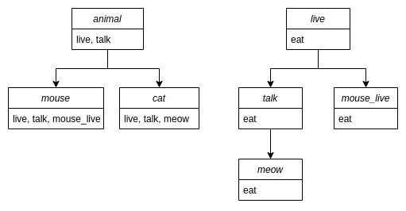

### Inheritance graph

Graph module takes a collection of `org.w3c.dom.Document` objects and constructs an inheritance graph, connecting all of them.
With this graph you can access the list of all the attributes present in an object in constant time.

#### Example:

Consider the following EO program.

```
[] > animal
  [] > live
    [] > eat
      stdout > @
        "Animal is eating"
    stdout > @
      "Animal is alive"
  [t] > talk
    live > @

[] > mouse
  animal > @
  [] > mouse_live
    ^.live > @

[] > cat
  animal > @
  [m] > meow
    ^.talk "Meow" > @
```

The resulting graph will look like below. Each node is represented with a rectangle. All the attributes
of the node are listed in the rectangle.


